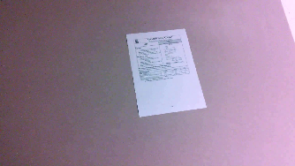
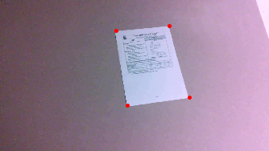

# DeePaperScan
A Deep Learning model that detects paper corners in pictures / videos

### Domain Backround

Mobile Scanners often use computer vision(ex. OpenCv) to detect corners of a scanned paper images in their smartphone apps. The main reasons are that the solution works well on basic cases and secondly it is easily deployable for real time usage (doesn't require a lot of hardware compute). 

I had the opportunity to find an available dataset that tackles this case. It consists of hundred of videos. For each video there is an xml file that contains 8 tags for each video frame (check dataset details in Datasets and Inputs). The tags represent the x,y coordinates of 4 corners of a document (check image).



My main motivation for this project is to check if training a Deep Neural Network on this dataset can showcase good results in real time scenario by detecting image corners (check image).



### Problem Statement

Image scanner that detects Paper/document corners in Image / video using a Convolution Neural Networks model

There are 4 corners positions to detect of a paper document (Top left, Top right, Bottom left, Bottom right) in different backgrounds.

Some of the most popular similar usecases available in Open Source community are Facial/hand Keypoint Detection, Human pose estimation ...

In Machine Learning terms this is a Regression task that is also known as keypoints / landmark detection. The model takes a resized Gray image with size (197,350,1) as input and produces the expected output that is the x,y coordinates of the 4 corners of a document.

### Datasets and Inputs

The dataset comes from the SMARTDOC 2015 competition (Smartphone Document Capture and OCR Competition) (link)[https://sites.google.com/site/icdar15smartdoc/challenge-1/challenge1description] [1]

The dataset has the following structure:

    smartdoc-dataset-set/
    ├── background01
    │   ├── datasheet001.avi
    │   ├── datasheet002.avi
    │   ├── datasheet003.avi
    │   ├── datasheet004.avi
    │   ├── datasheet005.avi
    │   ├── letter001.avi
    │   ├── letter002.avi
    │   ├── letter003.avi
    │   ├── letter004.avi
    │   ├── letter005.avi
    │   ├── magazine001.avi
    │   ├── magazine002.avi
    │   ├── magazine003.avi
    │   ├── magazine004.avi
    │   ├── magazine005.avi
    │   ├── paper001.avi
    │   ├── paper002.avi
    │   ├── paper003.avi
    │   ├── paper004.avi
    │   ├── paper005.avi
    │   ├── patent001.avi
    │   ├── patent002.avi
    │   ├── patent003.avi
    │   ├── patent004.avi
    │   ├── patent005.avi
    │   ├── tax001.avi
    │   ├── tax002.avi
    │   ├── tax003.avi
    │   ├── tax004.avi
    │   └── tax005.avi
    ├── background02
    │   ├── datasheet001.avi
    │   ...
    │   └── tax005.avi
    ├── background03
    │   ...
    ├── background04
    │   ...
    └── background05
        ...
        └── tax005.avi

It contains 5 directories(image backgrounds), and 150 video files (AVI container, XVID codec, no audio), where papers are taken from different angles.

The outpout

The output is given as 150 xml files:

    smartdoc-dataset-set/
    ├── background01
    │   ├── datasheet001.gt.xml
    │   ├── datasheet002.gt.xml
    │   ├── datasheet003.gt.xml
    │   ├── datasheet004.gt.xml
    │   ├── datasheet005.gt.xml
    │   ├── letter001.gt.xml
    │   ├── letter002.gt.xml
    │   ├── letter003.gt.xml
    │   ├── letter004.gt.xml
    │   ├── letter005.gt.xml
    │   ├── magazine001.gt.xml
    │   ├── magazine002.gt.xml
    │   ├── magazine003.gt.xml
    │   ├── magazine004.gt.xml
    │   ├── magazine005.gt.xml
    │   ├── paper001.gt.xml
    │   ├── paper002.gt.xml
    │   ├── paper003.gt.xml
    │   ├── paper004.gt.xml
    │   ├── paper005.gt.xml
    │   ├── patent001.gt.xml
    │   ├── patent002.gt.xml
    │   ├── patent003.gt.xml
    │   ├── patent004.gt.xml
    │   ├── patent005.gt.xml
    │   ├── tax001.gt.xml
    │   ├── tax002.gt.xml
    │   ├── tax003.gt.xml
    │   ├── tax004.gt.xml
    │   └── tax005.gt.xml
    ├── background02
    │   ├── datasheet001.gt.xml
    │   ...
    │   └── tax005.gt.xml
    ├── background03
    │   ...
    ├── background04
    │   ...
    └── background05
        ...
        └── tax005.gt.xml

Each Xml file contains labeled data of each frame of the corresponding video: 

One frame block looks like :

```
    <frame index="$frame_index" rejected="false">
      <point name="bl" x="$blx" y="bly"/>
      <point name="tl" x="$tlx" y="tly"/>
      <point name="tr" x="$trx" y="try"/>
      <point name="br" x="$brx" y="bry"/>
    </frame>
```
where:
- `$frame_index` is the index of the frame, starting at 1.
- `$blx` and `$bly` are the coordinates of the bottom left  point of the object
- `$tlx` and `$tly` are the coordinates of the top    left  point of the object
- `$trx` and `$try` are the coordinates of the top    right point of the object
- `$brx` and `$bry` are the coordinates of the bottom right point of the object


### Solution Statement

The solution consists on :

- Convert the dataset videos to image frames and xml files to a csv dataframe

- Prepare a sample of the Dataset  (around 7000 images), split it to train / validation

- Create a CNN model

- Train the model

- Test the model on the test images (outside of training / validation set)

- Discuss improvements and next steps

A first desired solution would be if the trained model can predict corners on real world images other than those in the dataset.

Next work will consist on using different CNN architectures, using data augmentation, and Transfer Learning

Future work would consist of converting the keypoint to a polygon and prepare a dataset to train using a segmentation methode (ex . Mask-RCNN)

The working method will be deployed in Sagemaker and exposed using lambda / Apigateway, and finally deploy it to a smartphone for real time prediction.

### Benchmark Model

Similar usecases using Keypoint detection :

The benchmark model I will be using is a CNN model based on the Facial Keypoint detection Model [2]. Basically it takes face images as input and predicts keypoints on face as outputs.

I will be using the same architecture and apply it to the smartdoc Dataset


### Evaluation Metrics

The usecase is mainly a Regression problem using images as input.

Evaluation metrics that will be used in the training / validation sets : 
- loss : mean squared error
- metrics : mean absolute error

### Project Design

Steps to develop this project:

1- Prepare the dataset

- Convert videos to images and store them in one folder

- Convert all xml files containing target label inside one dataframe

- create a sample of 7000 images from this dataframe

- split to train / validation (99%/1%)

- Create train / validation folders containing images

2- Preprocess input shape for model

- Resize image : decrease the size of the image so that it fits in GPU memory when training (turn to gray and decrease image to final shape : (197,350,1))

- Rescale landmarks/ Keypoints to to the new image size

3- Train model in Sagemaker using multiple Gpus [3]

- libraries used: Keras (Tensorflow Backend)

- CNN architecture [2] :

```
Layer (type)                 Output Shape              Param #   
=================================================================
conv2d_3 (Conv2D)            (None, 195, 348, 32)      320       
_________________________________________________________________
activation_5 (Activation)    (None, 195, 348, 32)      0         
_________________________________________________________________
max_pooling2d_3 (MaxPooling2 (None, 97, 174, 32)       0         
_________________________________________________________________
dropout_5 (Dropout)          (None, 97, 174, 32)       0         
_________________________________________________________________
conv2d_4 (Conv2D)            (None, 96, 173, 64)       8256      
_________________________________________________________________
activation_6 (Activation)    (None, 96, 173, 64)       0         
_________________________________________________________________
max_pooling2d_4 (MaxPooling2 (None, 48, 86, 64)        0         
_________________________________________________________________
dropout_6 (Dropout)          (None, 48, 86, 64)        0         
_________________________________________________________________
conv2d_5 (Conv2D)            (None, 47, 85, 128)       32896     
_________________________________________________________________
activation_7 (Activation)    (None, 47, 85, 128)       0         
_________________________________________________________________
max_pooling2d_5 (MaxPooling2 (None, 23, 42, 128)       0         
_________________________________________________________________
dropout_7 (Dropout)          (None, 23, 42, 128)       0         
_________________________________________________________________
flatten_1 (Flatten)          (None, 123648)            0         
_________________________________________________________________
dense_3 (Dense)              (None, 500)               61824500  
_________________________________________________________________
activation_8 (Activation)    (None, 500)               0         
_________________________________________________________________
dropout_8 (Dropout)          (None, 500)               0         
_________________________________________________________________
dense_4 (Dense)              (None, 500)               250500    
_________________________________________________________________
activation_9 (Activation)    (None, 500)               0         
_________________________________________________________________
dropout_9 (Dropout)          (None, 500)               0         
_________________________________________________________________
dense_5 (Dense)              (None, 8)                 4008      
=================================================================
Total params: 62,120,480
Trainable params: 62,120,480
Non-trainable params: 0
```

4- Deploy model on Sagemaker [3]

5- Test the model on new images

#### Reference

[1] Jean-Christophe Burie, Joseph Chazalon, Mickaël Coustaty, Sébastien Eskenazi, Muhammad Muzzamil Luqman, Maroua Mehri, Nibal Nayef, Jean-Marc OGIER, Sophea Prum and Marçal Rusinol: “ICDAR2015 Competition on Smartphone Document Capture and OCR (SmartDoc)”, In 13th International Conference on Document Analysis and Recognition (ICDAR), 2015.

[2] https://fairyonice.github.io/achieving-top-23-in-kaggles-facial-keypoints-detection-with-keras-tensorflow.html

[3] https://gitlab.com/juliensimon/dlnotebooks/blob/master/keras/05-keras-blog-post/Fashion%20MNIST-SageMaker.ipynb